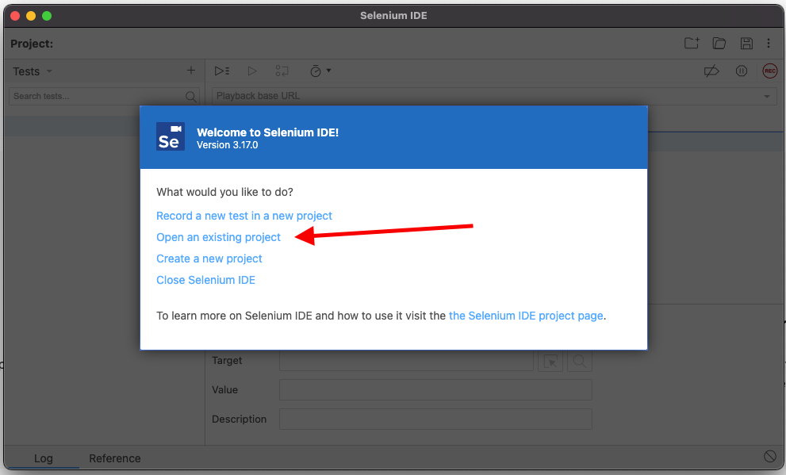
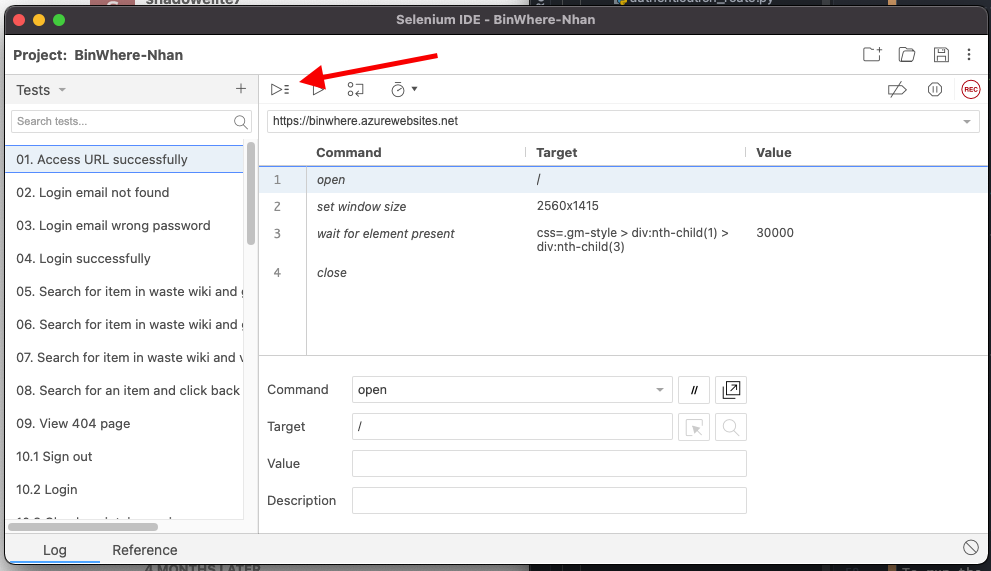
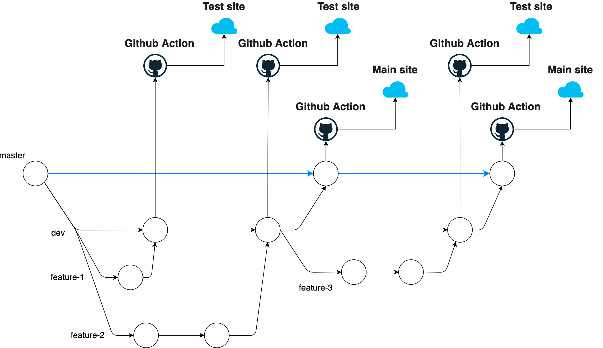

# BinWhere (COMP-2800-DTC-01) 

By offering locations of garbage and recycling bins, BinWhere aim to help people make environmentally friendly decisions 
and avoid littering on the street.

Production site: https://binwhere.azurewebsites.net/

Testing site: https://devbinwhere.azurewebsites.net/

## Getting Started

To be able to run this project you need to follow these steps below: 

### Prerequisites

* python 3.x [(Donwload Python)](https://www.python.org/downloads/)
* virtualenv [(venv)](https://docs.python.org/3/library/venv.html) 
* PyCharm IDE (or any kind of IDE) [(Donwload PyCharm)](https://www.jetbrains.com/pycharm/download)
* [Firebase](https://firebase.google.com/) console identity (contact us to be invited to the procject)

### Installing

1. Clone the repo
```
git clone https://github.com/hnngo/COMP-2800-Team-DTC-01-BinWhere.git
```

2. Navigate to where you clone and install all dependencies

```
cd /path/to/your/directory
python -m venv venv                // Create virual env folder
source ./bin/venv/activate         // Activate virtual env Linux/Macos
pip3 install -r requirements.txt   // Install all dependencies
```

To deactive env, run:

```
deactivate
```

## Running development

1. Either can use default flask command (in virtual env). This default command does not auto reload
when there is a new change
```angular2html
flask run
```

2. Or you can run using normal python command (in virtual env). This will enable auto reload when changes are made
```
python3 app.py      // Linux/Mac Os users

or

python app.py       // Window users
```

## Running the tests

To run the tests, you need to download [Selenium IDE](https://www.selenium.dev/selenium-ide/).

1. Install Selenium IDE
2. Load the test to Selenium IDE from file `/tests/BinWhere.side`  

3. Run all tests  

   
## Testing plan

You can find a thorough testing plan [here](https://docs.google.com/spreadsheets/d/1TzFauikB131mKv3lGaAGCtMYh2HjPbAMvGvGCp9YJSM/edit#gid=394496370).

## Deployment flow

We leverage Github Action to perform CI/CD flow and we have two separate environments test and production. Whenever `main` 
branch has new changes, Github Action will automatically deploy the changes to Azure production site. The same apply 
for `dev` branch, the only different is Github action deploy changes in `dev` to Azure testing site.




## API Keys

Currently, we are storing API keys directly in this project (which is not a good practice, will move soon) included:
1. Google Map API Keys
2. Twitter API keys
4. Firebase Credentials

## Built With

* [Flask](https://flask.palletsprojects.com/en/2.0.x/) - Web development framework
* [Cloud Firestore](https://firebase.google.com/products/firestore) - Database
* [Pyrebase4](https://firebase.google.com/products/firestore) - Python wrapper for Firebase API
* [Firebase admin SDK](https://firebase.google.com/docs/admin/setup) - Firebase SDK to interact with database
* [Tweepy](https://www.tweepy.org/) - Python library for accessing the Twitter API
* [Microsoft Azure](https://azure.microsoft.com/en-ca/) - Cloud computing service
* [Github action](https://github.com/features/actions) - Deployment automate tool

## Versioning

We use [Github](http://semver.org/) for versioning. For the versions available, see the [tags on this repository](https://github.com/hnngo/COMP-2800-Team-DTC-01-BinWhere/releases). 

## Authors

* **Nhan** - (https://github.com/hnngo)
* **Michael** - (https://github.com/michael-gagno)
* **Subin** - (https://github.com/Subin-Moon-44)
* **Heather** - (https://github.com/leeh1102)
* **Kaz** - (https://github.com/kazma-ku)

## Acknowledgments

* Loading spinner by loading.io can be found in here https://loading.io/css/ 

